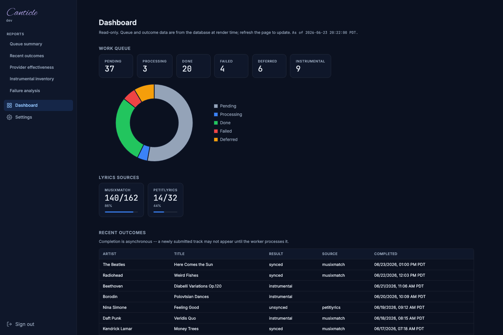
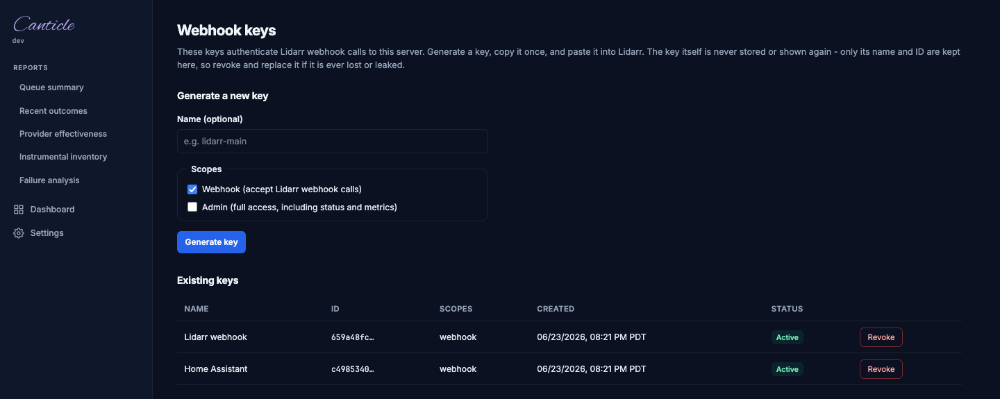

# User Guide

This guide covers running `canticle` as a long-running service: the Lidarr webhook server, path resolution, health endpoints, Docker and Unraid deployment, the optional filesystem watcher, shell completion, and the inspection commands. For one-shot fetching and the full flag list, see the [CLI Reference](CLI_REFERENCE.md). For every setting, see [Configuration](CONFIGURATION.md).

## Lidarr webhook server

```sh
MUSIXMATCH_TOKEN=YOUR_TOKEN MXLRC_WEBHOOK_API_KEY=mxlrc_your_webhook_key canticle --serve --listen 127.0.0.1:3876
MUSIXMATCH_TOKEN=YOUR_TOKEN MXLRC_WEBHOOK_API_KEY=mxlrc_your_webhook_key canticle serve --listen 127.0.0.1:3876
```

The server listens on `MXLRC_SERVER_ADDR` when `--listen` is not provided. Configure one or more webhook keys with `MXLRC_WEBHOOK_API_KEY`, use `canticle keys create`, or put the server address and webhook keys in a config file and start with `canticle serve --config path/to/config.toml`.

Webhook events are enqueued at high priority. If a webhook arrives for an artist/title that previously failed and is waiting out a retry backoff, the high-priority enqueue resets its retry timer so it becomes eligible immediately, jumping the queue. Scan-enqueued duplicates keep their existing backoff, so bulk scan traffic stays rate-limit protected. The worker's circuit breaker still pauses dequeuing globally when the upstream API signals rate limiting.

### Path resolution (Docker/Unraid)

Configured library scans are the source of truth for filesystem paths. When a Lidarr webhook arrives, `canticle` resolves the target file in this order:

1. **Scanned inventory.** The webhook artist/title is matched against persisted scan results (using the same normalization as the cache), and a match reuses the exact container-visible source path and output destination the scan recorded. This is why you should add and scan your libraries (`canticle library add ...`, then `canticle scan`) before relying on webhooks.
2. **Direct payload path.** If there is no inventory match but the webhook payload carries a `trackFiles` path that, after cleaning, lies inside one of your configured library roots and exists inside the `canticle` container, that path is used directly. Payload paths outside every configured root are never used as a write target; they fall back to metadata. This confinement is a security guard: it stops a webhook from directing a lyric write to an arbitrary location. As a result, raw payload-path resolution requires at least one configured library; with no libraries configured, step 2 is disabled and resolution goes straight from inventory to metadata.
3. **Metadata fallback.** Otherwise the lyrics are written to the configured `output.dir` using the webhook metadata.

On Unraid, Lidarr and `canticle` often see the same media through different mount paths. Because resolution prefers the scanned inventory, you do not need to maintain host-to-container path mappings: a payload path that is not visible inside the container, or that falls outside your configured library roots, simply falls back to metadata rather than failing.

Two operational notes:

- The library roots used to confine payload paths (step 2) are snapshotted when `serve` starts. A library added with `canticle library add ...` while `serve` is running is not recognized for raw-payload-path resolution until `serve` is restarted. (The periodic scheduler and watcher still pick up new libraries without a restart; only the webhook payload-path confinement uses the startup snapshot.)
- Inventory matching for tracks with non-ASCII artist/title metadata converges after one rescan following an upgrade. The key-backfill migration applies a best-effort ASCII fold to pre-existing rows; the exact normalized keys are written on the next library scan, so run `canticle scan` once after upgrading to make non-ASCII webhook matches reliable.

The scheduler scan interval and worker poll interval are configurable for Docker/Unraid deployments. Set `scan_interval_seconds` and `work_interval_seconds` under `[server]` in the config file, or override with `MXLRC_SCAN_INTERVAL` and `MXLRC_WORK_INTERVAL`. Precedence is CLI flag (`--scan-interval`, `--work-interval`) > environment variable > config file > default. Defaults preserve current behavior: scan interval 900 seconds, and worker interval falls back to `api.cooldown` (clamped to a 15-second floor). A scan interval of 0 scans once without repeating.

### Health and status endpoints

`serve` exposes lightweight endpoints for container orchestration:

- `GET /healthz` (unauthenticated) returns `200` with `{"status":"ok"}` whenever the HTTP server is accepting requests. Use it for Docker/Unraid liveness probes.
- `GET /readyz` (unauthenticated) verifies database reachability and returns `200` when ready or `503` when the database is unavailable. Error detail is omitted so it never leaks paths or connection strings.
- `GET /api/v1/status` (requires an `admin`-scoped API key) returns a queue summary grouped by status, for example `{"status":"ok","queue":{"pending":3,"failed":1}}`. It exposes no tokens, webhook keys, or filesystem paths.

Example Docker healthcheck: `curl -fsS http://127.0.0.1:3876/readyz`.

### Metrics endpoint

`GET /metrics` returns a Prometheus text-exposition (version 0.0.4) response suitable for scraping by Prometheus, Grafana Agent, or any compatible collector. Metrics are computed from read-only database queries at scrape time; there is no in-process registry or caching.

**Exposed metric families:**

| Metric | Type | Description |
|--------|------|-------------|
| `mxlrcgo_queue_items{status="..."}` | gauge | Work queue item count per status (`pending`, `processing`, `done`, `failed`, `deferred`). |
| `mxlrcgo_queue_failures{reason="..."}` | gauge | Failed queue items grouped by error reason. |
| `mxlrcgo_provider_hits_total{lane="..."}` | counter | Successful lyrics fetches per provider lane. |
| `mxlrcgo_provider_misses_total{lane="..."}` | counter | Benign no-result misses per provider lane. |
| `mxlrcgo_instrumental_tracks` | gauge | Queue items confirmed instrumental by audio detection. |

**Access control.** The endpoint is gated by the trusted-network allowlist, not an API key or session cookie. Loopback (`127.x.x.x`, `::1`) is always trusted. A remote scraper (Prometheus server, Grafana Agent, etc.) must have its host CIDR listed in `[server.trusted_networks].cidrs`. A spoofed `X-Forwarded-For` header cannot forge a trusted source.

To enable a remote scraper, add its CIDR to `config.toml`:

```toml
[server.trusted_networks]
cidrs = ["192.168.1.0/24"]   # replace with your Prometheus host's CIDR
```

Or override with the environment variable: `MXLRC_TRUSTED_CIDRS=192.168.1.0/24`.

Example Prometheus `scrape_configs` entry:

```yaml
scrape_configs:
  - job_name: mxlrcgo-svc
    static_configs:
      - targets: ["mxlrcgo-svc-host:3876"]
```

## Docker

The container runs the webhook service on port `50705` and stores its config and SQLite database under `/config`. Mount your media following the [TRaSH Guides](https://trash-guides.info/File-and-Folder-Structure/How-to-set-up/Unraid/) single-mount convention: map your data parent to `/data` and add your music root with `canticle library add /data/media/music`. In `serve` mode lyrics are written next to each audio file, so the container does not need an output directory: `MXLRC_OUTPUT_DIR` is ignored for normal serve output (it only sets the fallback location for the metadata-only webhook path, where no source file is known). Just mount your media and register the library; there is nothing else to point at an output folder.

Published GHCR tags:

- `latest` - latest stable `v*.*.*` release
- `<version>` - exact release version, for example `1.0.0`
- `<major>.<minor>` - stable minor line, for example `1.0`
- `beta` - latest prerelease channel tag
- `<version>-<pre>` - exact prerelease version, for example `1.1.0-beta.1` or `1.1.0-rc.1`
- `dev` / `nightly` - latest scheduled build from `main`
- `nightly-YYYYMMDD` - dated nightly build from `main`

```sh
docker run -d \
  --name canticle \
  -p 50705:50705 \
  -e MUSIXMATCH_TOKEN=YOUR_TOKEN \
  -e MXLRC_WEBHOOK_API_KEY=mxlrc_your_webhook_key \
  -e PUID=99 \
  -e PGID=100 \
  -v canticle-config:/config \
  -v /path/to/your/data:/data:rw \
  --restart unless-stopped \
  ghcr.io/sydlexius/canticle:latest
```

For Compose, copy `docker-compose.example.yml`, set `MUSIXMATCH_TOKEN` and `MXLRC_WEBHOOK_API_KEY`, adjust the music volume, then run:

```sh
docker compose up -d
```

`MXLRC_DOCKER=true` makes default storage paths resolve to `/config/config.toml` and `/config/mxlrcgo.db`.

To inspect or maintain the queue and scan state inside the container, exec the same `canticle queue` and `canticle scan results` / `canticle scan clear` commands documented in the [Inspection commands](#inspection-commands) section below (for example `docker exec canticle canticle queue failed`).

## Encrypted secrets

The two recoverable runtime secrets, the Musixmatch API token and the serve-mode webhook API key, can be stored encrypted at rest in the SQLite database (AES-256-GCM) instead of as plaintext in `config.toml` and environment variables. This is opt-in: existing env/TOML setups keep working unchanged, because the encrypted database store is the lowest-precedence source. CLI flags, environment variables, and TOML all still win over it.

### What it protects (and what it does not)

At-rest encryption defends a narrow boundary. It protects against database-only exfiltration: a copied or backed-up `.db` file, an accidental git commit, or a stray copy of just the database cannot be read back into the plaintext token. It does NOT protect a compromised running process (the decrypted values are in memory at use time), and it does NOT protect whole-volume theft when the key file lives in the same mount as the database. For whole-volume-theft protection, use `MXLRC_MASTER_KEY` or a separately-mounted key file (see below).

### Managing secrets

Three commands manage the encrypted store. None of them ever print a secret value.

```sh
# Encrypt the currently effective plaintext secret(s) into the database. Reads
# the normal CLI/env/TOML precedence but skips the database itself as a source,
# so it never copies the database onto itself. With no flag it imports both
# currently-set secrets; scope it with --token or --webhook.
canticle secrets import
canticle secrets import --token
canticle secrets import --webhook

# Set one secret by name from stdin. The value is read from the terminal prompt
# or a pipe, never from the command line (the command line lands in shell
# history and ps). Valid names: musixmatch_token, webhook_api_key.
canticle secrets set musixmatch_token        # prompts for the value
printf '%s' "$TOKEN" | canticle secrets set musixmatch_token   # or pipe it

# List stored secret names and their last-updated timestamps. Never prints values.
canticle secrets list
```

`secrets import` is idempotent: re-running overwrites the existing encrypted row. After a successful import, the command reminds you to remove the now-redundant plaintext from `config.toml` and your compose environment so it is no longer stored in the clear.

### Key management

The 32-byte encryption key is resolved from one of two sources, in order:

1. `MXLRC_MASTER_KEY` (base64 of 32 random bytes). When set, it takes precedence and no key file is read or written. Use this to keep the key entirely off the data volume (recommended hardening when your threat model includes whole-volume theft). Generate one with `openssl rand -base64 32`.
2. A key file (32 raw bytes, auto-generated with `0600` permissions on first use). The default location is a hidden `.mxlrcgo.key` beside the database. This is the **universal zero-setup default on all platforms, including Docker**. Override the location with the `secrets.key_file` TOML key or the `MXLRC_SECRETS_KEY_FILE` environment variable to place the key file on a separate, narrower mount.

A malformed `MXLRC_MASTER_KEY` or an unreadable key file is a loud, fatal startup error. The daemon never silently falls back to running unencrypted.

### Docker key setup

In Docker mode (storage paths resolve under `/config`), the daemon auto-creates a `0600` key file at `/config/.mxlrcgo.key` on first use - the same zero-setup behavior as native installs. No extra step is required to start.

**Important caveat:** `/config/.mxlrcgo.key` lives in the same bind-mount as the database. An attacker who copies the entire `/config` volume gets both the key and the ciphertext, so the at-rest encryption only protects against database-only exfiltration (backups, stray copies), not whole-volume theft. If that is in your threat model, set `MXLRC_MASTER_KEY` to keep the key off the data volume entirely:

```yaml
# docker-compose.yml - optional hardening: key separated from the data volume
services:
  canticle:
    image: ghcr.io/sydlexius/canticle:latest
    environment:
      # Optional. Generate once: openssl rand -base64 32
      # Source from a .env file NOT inside the /config volume.
      MXLRC_MASTER_KEY: ${MXLRC_MASTER_KEY}
    volumes:
      - ./config:/config
```

Alternatively, point `MXLRC_SECRETS_KEY_FILE` at a separately-mounted file to get key/data separation without an environment variable:

```yaml
    environment:
      MXLRC_SECRETS_KEY_FILE: /run/secrets/mxlrcgo_key
    secrets:
      - mxlrcgo_key
```

### Precedence

The encrypted database store is the lowest-precedence source for both secrets:

- Musixmatch token: `--token` CLI flag, then `MUSIXMATCH_TOKEN`, then `MXLRC_API_TOKEN`, then TOML `api.token`, then the encrypted database store.
- Webhook key: the CLI/env flag, then TOML `server.webhook_api_keys`, then the encrypted database store.

A higher-precedence source is used as-is at runtime and is never auto-persisted to the database. Persistence happens only when you run `secrets import` or `secrets set`.

### Key-loss recovery

Losing the key - a deleted `.mxlrcgo.key` file or a lost `MXLRC_MASTER_KEY` value - makes the encrypted secrets unrecoverable by design: there is no backdoor and no recovery key. The remedy is to re-enter the secrets with their original plaintext, by re-running `secrets import` (from a config or environment that still has the plaintext) or `secrets set`. Back up your key file or `MXLRC_MASTER_KEY` value in a safe location outside the data volume.

## Unraid

An Unraid Community Applications template is provided at `unraid/mxlrcgo-svc.xml`. It follows the same template conventions as the `sydlexius/unraid-templates` repository: GHCR image, bridge networking, `/config` appdata, a music library mapping, and advanced `PUID`/`PGID` permission and tuning fields (scan/work intervals and the filesystem watcher).

**Library mounts.** Prefer mapping the parent of your media into the container **once** and adding library roots beneath it, rather than a separate mount per library. This keeps container-visible paths stable and matches the single-mount convention used by the [TRaSH Guides Unraid layout](https://trash-guides.info/File-and-Folder-Structure/How-to-set-up/Unraid/), which maps `/mnt/user/data` to `/data` with media under `/data/media`:

| Host path | Container path |
|-----------|----------------|
| `/mnt/user/data` | `/data` |

Then register the library (or libraries) under it (paths are container-visible):

```sh
docker exec canticle canticle library add /data/media/music --name Music
docker exec canticle canticle scan
```

(Unlike the *arr apps, Canticle never moves or hardlinks files; it only reads audio and writes a `.lrc`/`.txt` sibling. The single-mount convention is still worth following so paths match the rest of your stack.)

If your music instead lives in several separate top-level shares, map their common parent once, or add one **Path** mapping per share beneath `/data/media` (for example `/mnt/user/<share>` to `/data/media/<share>`) and register each with `library add`. Lyrics are written next to each audio file, so libraries do not need a shared output root; set `MXLRC_OUTPUT_DIR` only for the webhook metadata-fallback case (step 3 under [Path resolution](#path-resolution-dockerunraid)).

### Web UI enablement

The browser UI is **off by default**. The serve listener only mounts the web routes when the UI is explicitly enabled, so a fresh Docker or Unraid deployment serves the webhook API alone until you turn it on.

**Enable it (headless).** Set `MXLRC_WEB_UI_ENABLED=true` in the container environment (the Unraid template ships this variable, and `docker-compose.example.yml` sets it). The equivalent config-file setting is `web_ui_enabled = true` under `[server]` in `config.toml`; the env var overrides the file when both are present. With the UI off, neither the pages nor the `/login` or `/setup` routes exist.

**Bootstrap the first admin (headless).** The setup page (`/setup`) is reachable **only from loopback or a configured trusted CIDR**, so a remote Unraid box cannot complete first-run setup through the browser. For headless deployments, create the first admin from the environment instead:

```sh
-e MXLRC_WEBAUTH_ADMIN_USER=admin
-e MXLRC_WEBAUTH_ADMIN_PASSWORD=your-strong-password
```

**Secret hygiene.** Never hardcode the bootstrap password in a compose file or source control. Supply it from an uncommitted `.env` file or a secret manager using `${MXLRC_WEBAUTH_ADMIN_PASSWORD}` interpolation, as shown in `docker-compose.example.yml`. The binary reads `MXLRC_WEBAUTH_ADMIN_PASSWORD` from the environment variable only - it does not read Docker or Swarm secret files (`/run/secrets/...`) directly. If you store the password as a Docker Secret, export it into the variable in your container entrypoint before the service starts: `export MXLRC_WEBAUTH_ADMIN_PASSWORD="$(cat /run/secrets/webauth_admin_password)"`.

Bootstrap behavior:

- **Both vars required.** Setting only one logs a warning and skips the bootstrap.
- **Password floor.** The password must be at least 8 characters. A shorter one is a **fatal startup error** (the container will not start), not a silent skip.
- **Idempotent.** The bootstrap runs only when no admin exists yet. Once any admin account is present it is skipped (never an overwrite), so leaving the vars set across restarts is harmless. The password is never logged.

**First login and cleanup.** After the container is up, browse to `http://[host]:[port]/login` and sign in with the bootstrapped credentials. Then **rotate the password from inside the UI and remove the `MXLRC_WEBAUTH_ADMIN_USER` / `MXLRC_WEBAUTH_ADMIN_PASSWORD` env vars** (and restart). Because the bootstrap is idempotent, the stale vars do nothing on the next start, but removing them keeps the plaintext password out of the container environment.

If the UI is reachable beyond your local machine, also read [Security considerations](#security-considerations) below: put it behind TLS so the session cookie is not sent in cleartext.

## Web UI: Dashboard

The Dashboard (`/dashboard`) is the default landing page after you sign in - the bare root (`/`) redirects to it. It is a read-only, never-cached observability view that runs live database queries at request time. It shows:




- **Work queue tiles and chart.** Counts of work queue items by status (pending, processing, done, failed, deferred), with a doughnut chart of the same segments.
- **Per-provider effectiveness tiles.** One tile per provider lane showing `hits/attempts` and an inline hit-rate bar (the percent is `hits / (hits + misses)`, where a hit means the lane served the winning result).
- **Instrumental count.** The number of tracks marked instrumental.
- **Recent outcomes.** The 20 most recently completed tracks (artist, title, album, result class, the provider lane that served it, and the completion time in the server's timezone when `TZ` is set, otherwise UTC).

The Dashboard requires the web UI to be enabled and an admin session (or a trusted-network request), the same as the other UI pages. For the deeper per-report views (queue summary, recent outcomes, provider effectiveness, instrumental inventory, failure analysis), see the [Reports workspace](#reports-workspace) below.

## Web UI: Settings page

The Settings page (`/settings`) is the single destination for editing the daemon configuration from the browser. It is available whenever `web_ui_enabled = true` and the operator is signed in as admin (or is accessing from a trusted network).

**Prerequisite.** The page is only reachable when the web UI is enabled (`web_ui_enabled = true` under `[server]` or `MXLRC_WEB_UI_ENABLED=true`). See [Web UI enablement](#web-ui-enablement) for the bootstrap steps.

### Tab layout

The page has three CSS-only tabs (no JavaScript round-trip to switch):

- **Common** - everyday fields: API token, webhook key, listen address, web UI toggle, and similar high-touch settings. This is the default tab.
- **Advanced** - every other field, organized by config section (API, output, providers, verification, instrumental detector, enrichment, guard, queue, logging, and so on).
- **Raw config** - a read-only view of the effective configuration as TOML, with secrets redacted. Use this to verify exactly what the daemon is running before a restart.

### Risk-tiered saves

Fields are classified into three risk tiers that control how a save is triggered:

- **safe** - auto-saves on change; no button click required.
- **caution** - requires an explicit Save button click.
- **critical** - requires Save plus a browser confirmation dialog before the value is written.

Changes are written to the config file and take effect on the next restart, not live. A status line below each field reports the result of the save POST.

### Locked fields

A field whose value is set by an environment variable or a command-line flag shows a "Locked" pill and cannot be edited in the UI. The override source is described below the field. To regain control from the UI, clear the environment variable (or remove the flag) and restart the daemon.

### CSRF

Write operations use a double-submit cookie token (`mx-csrf-token`). This is transparent during normal browser use but means direct `curl` POSTs without the matching cookie are rejected. The page must be loaded from the same origin before any write can succeed.

### Recommended workflow

1. Open the **Common** tab for routine changes (rotating the API token, updating the webhook key, changing the listen address).
2. Use the **Advanced** tab for tuning (backoff windows, provider mode, verification thresholds, etc.).
3. After saving, open the **Raw config** tab to verify the effective state before restarting the daemon.
4. Restart the daemon to apply changes.

## Webhook API keys

Lidarr (and any other webhook caller) authenticates to the serve listener with a webhook API key. Keys can be managed two ways: from the web UI or from the `canticle keys` CLI. Both write to the same key store in the database, so a key created on the CLI works for the UI list and vice versa.

A key's raw value is shown **exactly once** at creation and is unrecoverable afterward (only a hash is stored). Copy it then; if you lose it, revoke it and create a new one. Keys carry one or more scopes: `webhook` (accept Lidarr webhook calls - the common case) and `admin` (full access, including the status and metrics endpoints).

### From the web UI

The key management page lives at `/settings/keys` (reachable when the web UI is enabled and you are signed in as admin or on a trusted network). It shows a masked list of existing keys - truncated public ID, name, scopes, and the created/revoked timestamps in your local timezone - and a create form. The page never renders raw key material or a full hash.



- **Create.** Enter a name, choose the scopes (webhook is pre-checked), and submit. The new raw key is revealed once in the result panel.
- **Revoke.** Revocation is by public ID (the raw key is unrecoverable). A revoked key is shown struck through with its revocation time; it no longer authenticates.

Create and revoke are CSRF-protected (a same-origin form submission with the double-submit token), so direct `curl` POSTs without the page-issued cookie are rejected.

### From the CLI

```sh
# Create a key (prints the raw key once on stdout - save it).
canticle keys create --name lidarr --scope webhook
canticle keys create --name admin-tool --scope admin   # repeat --scope to grant several

# List keys: tab-separated public ID, name, scopes, and revoked-at (empty if active).
canticle keys list

# Revoke a key by passing its raw value.
canticle keys revoke <raw-api-key>
```

`keys create` prints only the raw key on stdout, so you can capture it directly (for example `KEY=$(canticle keys create --name lidarr)`). With no `--scope` flag the key defaults to the `webhook` scope. All three subcommands accept `--config` to point at a non-default config file. Under Docker, run them via `docker exec`, for example `docker exec canticle canticle keys list`.

The CLI and the `MXLRC_WEBHOOK_API_KEY` environment variable are independent ways to supply webhook keys: env/TOML keys (`server.webhook_api_keys`) are static configuration, while `keys create` mints managed keys in the database that can be listed and revoked individually.

## Windows

Download the signed `.zip` archive for `windows/amd64` from the [GitHub releases page](https://github.com/sydlexius/canticle/releases). Extract `canticle.exe` to one of:

- **`%LOCALAPPDATA%\mxlrcgo-svc\`** - user-mode install; no administrator rights required.
- **`C:\Program Files\mxlrcgo-svc\`** - system-wide install; requires administrator rights.

Add the chosen directory to your `PATH` so `canticle` is reachable from any shell.

**Manual run.** To start the server from a terminal (useful for initial testing):

```cmd
set MUSIXMATCH_TOKEN=YOUR_TOKEN
set MXLRC_WEBHOOK_API_KEY=mxlrc_your_webhook_key
canticle serve --listen 127.0.0.1:3876
```

Or use a config file to keep credentials out of the shell environment:

```cmd
canticle serve --config C:\path\to\config.toml
```

### NSSM service installation

[NSSM (the Non-Sucking Service Manager)](https://nssm.cc) wraps any executable as a Windows service with automatic restart, reliable start/stop, and log capture. Download a release build from [nssm.cc](https://nssm.cc/download) and place `nssm.exe` somewhere on your `PATH`.

**Install the service.** Run the following from an elevated (Administrator) Command Prompt:

```cmd
nssm install mxlrcgo-svc
```

NSSM opens a GUI. Fill in the tabs:

- **Application tab:**
  - *Path*: full path to `canticle.exe`, for example `C:\Program Files\mxlrcgo-svc\canticle.exe`
  - *Arguments*: `serve --listen 0.0.0.0:3876` (or `serve --config C:\path\to\config.toml` if you use a config file)
  - *Startup directory*: the directory containing `canticle.exe`

- **Environment tab.** Add one variable per line:

  ```
  MUSIXMATCH_TOKEN=YOUR_TOKEN
  MXLRC_WEBHOOK_API_KEY=mxlrc_your_webhook_key
  MXLRC_DB_PATH=C:\ProgramData\mxlrcgo-svc\mxlrcgo.db
  ```

  Set `MXLRC_DB_PATH` explicitly so the database lives in a known, writable location rather than depending on the service account's XDG defaults (see [Data location](#data-location) below).

- **I/O tab.** Set *Stdout* and *Stderr* to a log file, for example `C:\ProgramData\mxlrcgo-svc\logs\mxlrcgo-svc.log`. NSSM rotates these automatically.

Click *Install service*, then start it:

```cmd
nssm start mxlrcgo-svc
```

**Manage the service:**

```cmd
nssm start mxlrcgo-svc
nssm stop mxlrcgo-svc
nssm restart mxlrcgo-svc
nssm status mxlrcgo-svc
nssm remove mxlrcgo-svc confirm   # uninstall
```

To update the configuration after installation, run `nssm edit mxlrcgo-svc` from an elevated prompt.

### Data location

Without an explicit `MXLRC_DB_PATH`, `canticle` resolves storage paths via XDG base directories. On Windows these defaults resolve to:

| Item | Default path |
|------|-------------|
| Config file | `C:\Users\<user>\.config\mxlrcgo-svc\config.toml` |
| Database | `C:\Users\<user>\.local\share\mxlrcgo-svc\mxlrcgo.db` |

A service account resolves these under its own profile, which may not be immediately obvious. Set `MXLRC_DB_PATH` (and `--config`) explicitly in the NSSM environment tab to put data in a known, persistent location (for example `C:\ProgramData\mxlrcgo-svc\`).

Removing or uninstalling the NSSM service does **not** delete the database or config file. Remove them manually for a clean uninstall.

### SmartScreen note

Even signed binaries can trigger the "Windows protected your PC" prompt on first launch when the executable's download reputation is too low. If you see this:

1. Click **More info**.
2. Click **Run anyway**.

This prompt should not appear again after the first run. See [issue #183](https://github.com/sydlexius/canticle/issues/183) for background on code signing.

## Native packages

The `.deb`, `.rpm`, and `.apk` packages install the binary, a service unit, and an example config. They do not enable or start the service on install; you must do that manually after setting your token.

### System user and state directory

The post-install script creates a `mxlrcgo-svc` system user and group (no login shell, no home-directory creation), then initializes `/var/lib/mxlrcgo-svc` (mode `0750`, owned by `mxlrcgo-svc:mxlrcgo-svc`). The service unit sets `MXLRC_DB_PATH=/var/lib/mxlrcgo-svc/mxlrcgo.db` and `MXLRC_LOG_FORMAT=json` in its environment.

### Hardening

The systemd unit runs with `ProtectSystem=strict`, `ProtectHome=true`, `PrivateTmp=true`, and `NoNewPrivileges=true`. Only `/var/lib/mxlrcgo-svc` is writable. The OpenRC service on Alpine enforces the same ownership via `start_pre`.

### Config file

Copy the example and set your token before starting the service:

```sh
sudo cp /etc/mxlrcgo-svc/config.example.toml /etc/mxlrcgo-svc/config.toml
sudo editor /etc/mxlrcgo-svc/config.toml
```

The service reads `/etc/mxlrcgo-svc/config.toml` automatically when `MXLRC_DB_PATH` is the native-package default. Pass `--config /etc/mxlrcgo-svc/config.toml` explicitly if you override the database path.

### Service management

**systemd (Debian / Ubuntu / RHEL / Fedora / Rocky):**

```sh
sudo systemctl enable mxlrcgo-svc   # start on boot
sudo systemctl start mxlrcgo-svc
sudo systemctl stop mxlrcgo-svc
sudo systemctl restart mxlrcgo-svc
sudo systemctl status mxlrcgo-svc
sudo journalctl -u mxlrcgo-svc -f   # follow logs
```

**OpenRC (Alpine):**

```sh
sudo rc-update add mxlrcgo-svc default   # start on boot
sudo rc-service mxlrcgo-svc start
sudo rc-service mxlrcgo-svc stop
sudo rc-service mxlrcgo-svc restart
sudo rc-service mxlrcgo-svc status
```

### Data preservation on removal

Package removal stops the service but intentionally preserves `/var/lib/mxlrcgo-svc` (the SQLite database and any config) and the `mxlrcgo-svc` system user. This means reinstalling or upgrading the package keeps your cache and settings. Remove the directory manually for a clean uninstall:

```sh
sudo rm -rf /var/lib/mxlrcgo-svc
sudo userdel mxlrcgo-svc
sudo groupdel mxlrcgo-svc
```

## Recording enrichment

Recording enrichment reads the ISRC, MusicBrainz recording ID, and duration from each file's audio tags and passes them to the matcher to disambiguate results (for example, telling two same-titled recordings apart). It is on by default.

You can control it at three levels, resolved with the precedence **CLI flag > per-library setting > global default**:

- **Global default** (`config.toml`): `[enrichment] enabled = true` (env `MXLRC_ENRICHMENT_ENABLED`). Default `true`. Set `false` to skip enrichment everywhere unless a library or run opts back in.
- **Per library**: `canticle library add/update --enrich` (force on) or `--enrich=false` (force off). Omit the flag to inherit the global default.
- **Per run**: `canticle scan --enrich` or `--no-enrich` overrides both for that single scan (the two flags are mutually exclusive). The serve-mode scheduler has no per-run flag; it resolves per library against the global default.

When enrichment is off for a track, the scanner skips ISRC, MBID, and duration extraction as a unit, and the track keeps the `duration_bucket = 0` cache fallback (no behavior regression). A per-library or global change only affects scans run after the change; it does not restamp already-scanned rows.

## Instrumental detection

The optional instrumental-detection sidecar samples each track's audio with ffmpeg and asks an external classifier whether it is instrumental, writing an instrumental marker on a provider miss. It runs only when a classifier URL is configured (`[instrumental_detector] classifier_url`). Because it costs an ffmpeg sample plus an inference call per track, you may want it on a small curated or soundtrack-heavy library but off on a large bulk one.

For how the detector decides (the two-gate model), the YAMNet sidecar setup and `{mean,max}` contract, deploy ordering, and threshold tuning, see the dedicated [Instrumental Detection](instrumental-detection.md) reference. This section covers only the enable/override controls.

You control it at three levels, resolved with the precedence **CLI flag > per-library setting > global default**:

- **Global default** (`config.toml`): `[instrumental_detector] enabled` (env `MXLRC_INSTRUMENTAL_DETECTOR_ENABLED`). Default `false`.
- **Per library**: `canticle library add/update --detect-instrumental` (force on) or `--detect-instrumental=false` (force off). Omit the flag to inherit the global default.
- **Per run**: `canticle scan --detect-instrumental` or `--no-detect-instrumental` overrides both for the tracks enqueued by that scan (the two flags are mutually exclusive). serve has no per-run flag; it resolves per library against the global default.

The decision is resolved and stamped onto each work-queue item when it is enqueued (like the provider-set version), so a per-library or global change only affects tracks enqueued after the change. Tracks queued before per-library detection existed carry no decision and fall back to the global default at processing time. If an item requests detection but no `classifier_url` is configured, the worker logs an error and proceeds without detection (it never silently skips).

## Filesystem watcher (optional, low-latency scans)

By default, `serve` only scans on the scheduler's tick (`--scan-interval`, default 900s), so a new track dropped into the library waits up to that interval before lyrics are fetched. An optional filesystem watcher reacts within seconds for the common single-host case. It is disabled by default and configured entirely through environment variables:

| Variable | Default | Purpose |
|----------|---------|---------|
| `MXLRCGO_WATCH_ENABLED` | `false` | Master switch. When unset/false, behavior is exactly as before. |
| `MXLRCGO_WATCH_DEBOUNCE_MS` | `2000` | Quiet period after the last event before a directory is scanned. Coalesces the event storms that taggers (Beets, Picard) produce when rewriting an album. |
| `MXLRCGO_WATCH_MAX_DIRS` | `100000` | Safety cap. Startup fails loudly if the configured roots contain more directories than this, rather than silently exceeding the kernel watch budget. |

When a file appears or changes, the watcher scans the affected directory (and its subtree, up to the configured scan depth) under the owning library and enqueues any cache misses at scan priority.

The watcher is **best-effort and in addition to** the periodic scan, never a replacement:

- Bind-mounted volumes, NFS, SMB, and Docker Desktop on macOS frequently drop or never emit filesystem events.
- Events that fire while the container is down are lost; there is no replay. The periodic scan reconciles them.
- On Linux, very large libraries may require raising the inotify watch limit, e.g. `sysctl fs.inotify.max_user_watches=524288`.

### Watcher-primary mode

Because the periodic scheduler remains the source of truth, you can run the watcher as the primary trigger and demote the periodic scan to a long reconcile backstop. Enable the watcher and raise the interval, e.g.:

```sh
MXLRCGO_WATCH_ENABLED=1
MXLRC_SCAN_INTERVAL=21600   # 6h reconcile backstop (seconds)
```

The startup scan always runs regardless of the interval, so initial reconciliation is guaranteed. Do **not** set the interval to `0` (scan-once) unless you have verified the watcher actually delivers events on your filesystem, because then nothing reconciles missed events.

### Verifying watcher events

The watcher emits `INFO "watcher started"` at boot (with library and directory counts). To confirm it is actually receiving events, enable debug logging (`MXLRC_LOG_LEVEL=debug`) and `touch` a file under a library root, then watch for `DEBUG "watcher: event received"` and a follow-up scan. If nothing appears, your filesystem is not delivering inotify events to the container and you must keep the periodic scan as the source of truth. Common offenders: **Unraid `/mnt/user` (FUSE/shfs) bind mounts**, NFS without NFSv4.1 delegations, SMB/CIFS, and Docker Desktop's virtualized mounts.

## Shell completion

`canticle completion <bash|zsh|fish>` prints a sourceable completion script that completes subcommands, flags, and configured library names (the last queried live from the database, degrading gracefully when it is absent):

```bash
source <(canticle completion bash)                 # bash (e.g. in ~/.bashrc)
source <(canticle completion zsh)                  # zsh  (e.g. in ~/.zshrc)
canticle completion fish > ~/.config/fish/completions/canticle.fish
```

The scripts call a hidden `__complete` handler; library-name completion never creates the database.

## Security considerations

**Web UI and admin bootstrap.** The browser UI is off by default; enabling it and bootstrapping the first admin on a headless Docker/Unraid host is covered in [Web UI enablement](#web-ui-enablement) under the Unraid section. The short version: enable with `MXLRC_WEB_UI_ENABLED=true`, bootstrap with `MXLRC_WEBAUTH_ADMIN_USER` / `MXLRC_WEBAUTH_ADMIN_PASSWORD` (8-char minimum, idempotent), then rotate the password and remove those env vars after first login. The interactive `/setup` page is restricted to loopback or a trusted CIDR, so env-bootstrap is the headless path.

**Session cookie and TLS.** The browser session cookie (`mxlrc_session`) has its `Secure` flag set automatically when the connection is TLS - either a direct TLS listener or a trusted reverse proxy that sets `X-Forwarded-Proto: https`. On a plain-HTTP deployment the `Secure` flag is off and the cookie is sent in cleartext, which exposes it to network interception. If the web UI is reachable from outside your local machine, run it behind a TLS-terminating reverse proxy (nginx, Caddy, Traefik) or enable the built-in TLS listener (`[server.tls]` in `config.toml`). See `README.md` for TLS configuration options.

## Inspection commands

The `queue` and `scan` subcommands expose the durable work queue and persisted
scan results so you can debug what the service is doing without opening the
SQLite database by hand.

```sh
# List the next 50 work_queue rows.
canticle queue list

# Filter by status; failed and deferred are also exposed as convenience subcommands.
canticle queue list --status pending --limit 100
canticle queue failed

# List deferred rows: benign misses (a track Musixmatch has no lyrics for yet)
# waiting out a fixed cooldown before re-check. These are NOT failures and are
# kept out of `queue failed`.
canticle queue deferred

# Reset a single failed row back to pending. Refused if the row is not failed
# (a deferred row is refused; let it re-check on its own, or re-trigger via webhook).
canticle queue retry 42

# Delete completed rows. Without --yes, prints what would be deleted.
canticle queue clear --done
canticle queue clear --done --yes

# List persisted scan_results, optionally filtered by library (name or id) and status.
canticle scan results
canticle scan results --library Music --status pending
canticle scan results --library 1 --limit 200

# Delete every scan_results row for a single library. Without --yes, prints what would be deleted.
# The library row itself is left intact.
canticle scan clear --library Music
canticle scan clear --library Music --yes
```

## Reports workspace

The web UI exposes five read-only report views under the Reports section. Every report runs a live database query at request time; there is no pre-aggregation or caching. The reports require the web UI to be enabled (`web_ui_enabled = true`).

### Queue summary

Shows the count of work queue items grouped by status: pending, processing, done, failed, deferred, and total. Use this as a quick health check - a rising `failed` count warrants a look at the Failure analysis report; a large `deferred` count is normal (those are benign misses awaiting their next retry).

### Recent outcomes

Lists the most recently completed tracks, newest first, with:
- Artist, title, and album.
- Completion timestamp.
- Provider lane that served the result.
- Result class: `synced` (an `.lrc` was written), `unsynced-or-instrumental` (a `.txt` was written - covers both plain unsynced lyrics and instrumental markers), or `miss` (the track exhausted its miss budget with no lyrics found).

Note: `.txt` results group plain unsynced lyrics and audio-detected instrumentals together. Use the Instrumental inventory report to isolate audio-detected instrumentals.

### Provider effectiveness

Shows per-lane hit/miss counts and a true per-track hit-rate for each provider lane. The hit-rate is computed as `hits / (hits + misses)` where a "hit" means the lane served the winning result and a "miss" means the lane was tried but did not win (including being outcompeted by a later lane in ordered mode).

**No-backfill caveat.** This report reads the `lane_attempts` table, which was added in a later migration. Traffic that predates the migration has no lane-level records, so the report shows an empty state until new attempts accrue after the migration. This is expected; no historical backfill is possible.

### Instrumental inventory

Lists every work queue item the audio detector confirmed as instrumental, joined to the source file path from scan results. Each item shows:
- Artist and title.
- Source file path (empty for items enqueued via CLI without a library scan link).
- Whether per-item detection was requested explicitly, inherited from a library setting, or fell back to the global default.

Use this to audit which tracks the detector marked instrumental and whether they match expectation.

### Failure analysis

Lists failed and deferred work queue items grouped by status and error reason, with a count per group, ordered most-frequent first. "Failed" rows hit a hard error; "deferred" rows are benign misses waiting for a retry. Grouping keeps the two separate because they require different responses - deferred rows self-resolve on their retry schedule, while failed rows may need manual intervention (`canticle queue retry <id>`).
